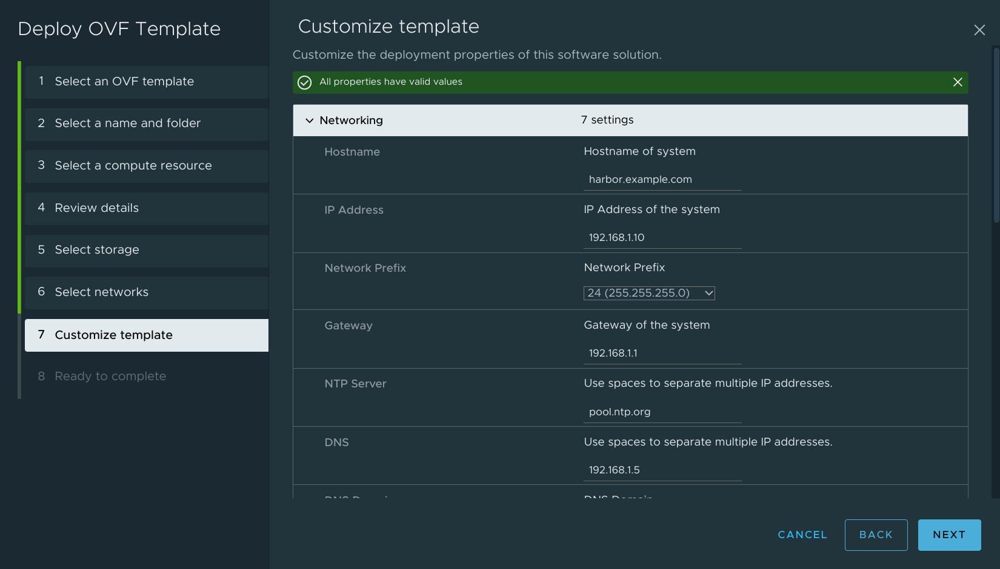

# Harbor OVA built with Packer

What is [Harbor](https://goharbor.io/)?
> Harbor is an open source registry that secures artifacts with policies and role-based access control, ensures images are scanned and free from vulnerabilities, and signs images as trusted. Harbor, a CNCF Graduated project, delivers compliance, performance, and interoperability to help you consistently and securely manage artifacts across cloud native compute platforms like Kubernetes and Docker.

This project is adapted from [William Lam's work](https://github.com/lamw/harbor-appliance) to:
- Translate from JSON to HCL format
- Migrate from the [`vmware-iso` builder](https://www.packer.io/plugins/builders/vmware/iso) to the[`vsphere-iso` one](https://www.packer.io/plugins/builders/vsphere/vsphere-iso) which
  - Leverages an API connection to vCenter instead of SSH connection to the host
  - Eliminates the need for the `/Net/GuestIPHack` advanced configuration for ESXi
  - Supports connecting the template VM to a dvPortGroup
- Incorporate a *lot* of additional parameterization (and a bit of hardening) to help make the resulting OVA more ready for use in production environments

## Requirements

* MacOS or Linux Desktop
* vCenter Server
* vSphere Cluster running ESXi 6.5+ (DRS not required, single host will do)
* [VMware OVFTool](https://developer.vmware.com/web/tool/4.4.0/ovf)
* [Packer](https://www.packer.io/intro/getting-started/install.html)
* [PowerCLI](https://developer.vmware.com/powercli/installation-guide) (for removing source VM after OVA export)
* Packer account in vCenter with [appropriate permissions](https://www.packer.io/plugins/builders/vsphere/vsphere-iso#required-vsphere-privileges)

## Procedure
Step 1 - Clone the git repository
```
git clone https://github.com/jbowdre/harbor-appliance.git
```

Step 2 - Copy `env-example.pkrvars.hcl` to `env.auto.pkrvars.hcl` and update accordingly:
```
# vSphere Environment
vsphere_cluster               = "Cluster-1"
vsphere_datacenter            = "Datacenter-1"
vsphere_datastore             = "Datastore-1"
vsphere_endpoint              = "vcenter.example.com"
vsphere_folder                = "_Templates"
vsphere_host                  = null
vsphere_insecure_connection   = true
vsphere_network               = "Network-1"
vsphere_password              = "hunter2"
vsphere_username              = "packer"

# Guest Credentials
guest_root_password           = "hunter2"
```

Step 3 - Review `harbor.auto.pkrvars.hcl` and change any other options you think might be fun - in particular, the `Appliance Config` session defines the properties and default values that will be shown when deploying the OVA:
```
# Harbor
harbor_compose_version    = "2.16.0"
harbor_ovf_template       = "photon.xml.template"
harbor_version            = "2.7.1"

# Appliance Config
appliance_def_admin_user  = "admin"
appliance_def_dns         = "192.168.1.5"
appliance_def_domain      = "example.com"
appliance_def_gateway     = "192.168.1.1"
appliance_def_hostname    = "harbor.example.com"
appliance_def_ip          = "192.168.1.10"
appliance_def_ntp         = "pool.ntp.org"
appliance_product         = "Harbor Appliance"
appliance_product_url     = "https://github.com/jbowdre/harbor-appliance"
appliance_vendor          = "VirtuallyPotato"
appliance_vendor_url      = "https://virtuallypotato.com"
```

Step 4 - Start the build by running the build script which simply calls Packer and the respective build files
```
./build.sh
````

If the build was successful, you will find the Harbor OVA located in `output-vsphere-iso/HarborAppliance.ova`

You can then [deploy the OVA to vSphere](https://docs.vmware.com/en/VMware-vSphere/7.0/com.vmware.vsphere.vm_admin.doc/GUID-17BEDA21-43F6-41F4-8FB2-E01D275FE9B4.html) like usual. You'll be prompted to set up the initial settings during the template deployment.



Once the VM boots up, follow the [What to Do Next](https://goharbor.io/docs/2.7.0/install-config/run-installer-script/#what-to-do-next) instructions to get up and running.

Harbor will be installed in `/opt/harbor/` on the appliance in case you need to [reconfigure anything there](https://goharbor.io/docs/2.7.0/install-config/reconfigure-manage-lifecycle/).
